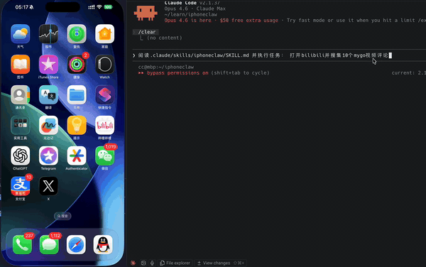

# iphoneclaw

[English](README.md) | [中文](README.zh.md)

**iPhone + AI，开源版 Apple Intelligence：让 Agent 接管你的 iPhone。**




完整演示视频: [assets/iphoneclaw.mp4](assets/iphoneclaw.mp4)

官网: https://iphoneclaw.com

## 卖点卡片

<table>
  <tr>
    <td width="33%">
      <b>真实用户录制</b><br/>
      用 <code>script record-user</code> 把真实鼠标/滚动/热键行为录成可重放脚本。
    </td>
    <td width="33%">
      <b>一键脚本重放</b><br/>
      用 <code>script run</code> 直接回放录制流程，快速落地 iPhone 自动化。
    </td>
    <td width="33%">
      <b>确定性脚本库</b><br/>
      在 <code>action_scripts/registry.json</code> 注册流程，agent 用 <code>run_script(name=...)</code> 低 token 调用。
    </td>
  </tr>
  <tr>
    <td width="33%">
      <b>Claude Code / Codex Skill</b><br/>
      可直接接入 Claude Code/Codex 工作流，通过 <code>run_script(name=...)</code> 调用确定性动作。
    </td>
    <td width="33%">
      <b>L0 记忆缓存提速</b><br/>
      已见过的屏幕可直接重放已验证动作，减少重复 VLM 调用。
    </td>
    <td width="33%">
      <b>自动化业务场景</b><br/>
      可覆盖抢红包类流程、蚂蚁森林能量收取类流程等高频重复任务。
    </td>
  </tr>
</table>

`iphoneclaw` 是一个 **macOS-only** 的 Python CLI Worker：通过 **iPhone 镜像 / iPhone Mirroring** 窗口，让 VLM（Vision Language Model）以 UI-TARS 风格的 `Thought:` / `Action:` 循环来操控你的 iPhone。

核心流程:

1. 截取 iPhone 镜像窗口截图（Quartz CGWindowList）
2. **L0 记忆缓存检查** — 如果截图指纹（dHash）匹配到之前已成功执行过的屏幕，直接重放缓存动作，跳过 VLM 调用
3. 调用 OpenAI-compatible 的多模态接口（L0 命中时跳过）
4. 解析 `Thought:` / `Action:`
5. 用 Quartz CGEvent 执行鼠标/键盘操作
6. 验证并记录每一步到 `runs/`

同时提供 **本地 Supervisor API**（仅文本 + SSE），便于外部 Agent 框架监督运行：拉取最近 N 轮对话、订阅实时事件，并通过 `pause/resume/stop/inject` 进行干预。设计目标是可以接入 **Claude Code / Codex** 等编排框架，让“老板 Agent”监管这个 UI Worker。

同时支持“持续学习”：supervisor 可以把经验教训记录在 `WORKER_DIARY.md`，并在每次新任务开始前先查一查，让 worker 越用越熟练。

社区日记仓库（需用户同意后再提交 PR）：https://github.com/NoEdgeAI/awesome-iphoneclaw-diary

## 可实现的自动化能力（真实录制 + 重放）

iphoneclaw 现在支持 **真实用户行为录制** 与 **脚本重放**，可以直接用于 iPhone 自动化流程：

- 在 iPhone 镜像窗口内真实录制：
  - `python -m iphoneclaw script record-user --app "iPhone Mirroring" --out action_scripts/recorded/my_live_flow.txt`
- 回放已录制脚本：
  - `python -m iphoneclaw script run --app "iPhone Mirroring" --file action_scripts/recorded/my_live_flow.txt`
- 可将高频流程注册到 `action_scripts/registry.json`，让 agent 通过 `run_script(name=...)` 低 token 调用。

典型场景：

- 每日重复操作（打开 App、固定导航、签到、固定点击序列）
- 活动类交互（例如抢红包一类流程）
- 绿色应用日常流程（例如蚂蚁森林能量收取一类流程）

说明：

- 脚本越聚焦、越确定性，回放稳定性越高。
- 自动化操作请遵守目标平台条款与本地法律法规。

## 设备与系统要求

- 一台 Mac（Mac mini / MacBook）+ 一台 iPhone
- 支持 iPhone 镜像:
  - Mac 升级到 **macOS Sequoia（macOS 15）** 或更高
  - iPhone 升级到 **iOS 18** 或更高
  - Mac 和 iPhone 使用 **同一 Apple ID** 登录
- Python >= 3.9
- 终端需要授予 Screen Recording（屏幕录制）与 Accessibility（辅助功能）权限

## 安装

```bash
git clone https://github.com/NoEdgeAI/iphoneclaw.git
cd iphoneclaw

# pip
pip install -e .

# 或 uv
uv pip install -e .
```

包含开发依赖（可选）:

```bash
pip install -e ".[dev]"
# 或
uv pip install -e ".[dev]"
```

检查权限:

```bash
iphoneclaw doctor
```

如果 Screen Recording 或 Accessibility 显示 **MISSING**，到 **System Settings > Privacy & Security** 给你的终端程序授权。

## 推荐模型

iphoneclaw 支持任意 OpenAI-compatible 的视觉模型接口。以下是常见选项:

### 选项 A: UI-TARS + vLLM（自建）

UI-TARS 是字节系 GUI agent 模型，天然输出 iphoneclaw 需要的 Action 格式。

```bash
python -m vllm.entrypoints.openai.api_server \
  --served-model-name ui-tars \
  --model ByteDance-Seed/UI-TARS-1.5-7B \
  --limit-mm-per-prompt image=5 \
  -tp 1
```

运行:

```bash
python -m iphoneclaw run \
  --instruction "打开设置并开启 Wi-Fi" \
  --base-url http://127.0.0.1:8000/v1 \
  --model ui-tars
```

### 选项 B: 火山 Ark（Doubao）

```bash
export IPHONECLAW_MODEL_BASE_URL="https://ark.cn-beijing.volces.com/api/v3"
export IPHONECLAW_MODEL_API_KEY="your-ark-api-key"
export IPHONECLAW_MODEL_NAME="doubao-1-5-ui-tars-250428"

python -m iphoneclaw run \
  --instruction "打开设置并开启 Wi-Fi"
```

### 选项 C: Qwen2.5-VL + vLLM（自建，可选）

Qwen2.5-VL 也能很好地完成屏幕理解与 UI 操作（只要输出符合 `Thought:` / `Action:` 格式）。

```bash
pip install vllm

vllm serve Qwen/Qwen2.5-VL-7B-Instruct \
  --host 0.0.0.0 --port 8000 \
  --served-model-name qwen-vl \
  --limit-mm-per-prompt '{"image":2,"video":0}'
```

运行:

```bash
python -m iphoneclaw run \
  --instruction "打开设置并开启 Wi-Fi" \
  --base-url http://127.0.0.1:8000/v1 \
  --model qwen-vl
```

## 快速开始

```bash
# 1) 权限检查
python -m iphoneclaw doctor

# 2) 启动并验证窗口识别
python -m iphoneclaw launch --app 'iPhone镜像'

# 3) 测试截图（包含自动裁剪白边校准）
python -m iphoneclaw screenshot --out /tmp/shot.jpg

# 4) 运行 worker
python -m iphoneclaw run \
  --instruction "打开设置并开启 Wi-Fi"
```

## CLI 命令一览

```
iphoneclaw doctor          检查 macOS 权限
iphoneclaw launch          启动目标 App 并输出窗口 bounds
iphoneclaw bounds          输出窗口 bounds (x y w h)
iphoneclaw screenshot      截图（窗口 -> JPEG）
iphoneclaw calibrate       截图 + 坐标映射信息
iphoneclaw windows         枚举可见窗口（调试用）
iphoneclaw run             运行 agent loop + supervisor API
iphoneclaw serve           只启动 supervisor API（不跑 worker）
iphoneclaw ctl             通过 supervisor API 控制/查看 worker
iphoneclaw script          动作脚本（解析/运行/录制/真实录制/导出）
```

## 动作脚本（L1）

iphoneclaw 支持 **本地动作脚本** 来减少 token 消耗，并把常见操作流程固化为可复用的脚本。

- 注册表：`action_scripts/registry.json`（短名 -> 脚本路径）
- 脚本文件：`action_scripts/common/*.txt`（常用）与 `action_scripts/recorded/*.txt`（录制/导出）
- 模型/agent 可以只输出一个低 token 的动作：
  - `run_script(name='open_app_spotlight', APP='bilibili')`
  - worker 会把它展开成具体动作序列并执行

### 本地运行脚本

```bash
python -m iphoneclaw script run --file action_scripts/common/open_app_spotlight.txt --var APP=bilibili
```

### 录制或导出脚本

```bash
# 真实录制用户行为（鼠标/滚动/热键），仅记录目标窗口内事件
# Ctrl-C 停止；或用 --seconds N 定时停止
python -m iphoneclaw script record-user --app "iPhone Mirroring" --out action_scripts/recorded/my_live_flow.txt

# 从 stdin 录制动作文本（Ctrl-D 结束；不是实时鼠标/键盘行为录制）
python -m iphoneclaw script record --out action_scripts/recorded/my_flow.txt

# 从历史 runs/<id>/events.jsonl 导出可重放脚本
python -m iphoneclaw script from-run --run-dir runs/<run_id> --out action_scripts/recorded/<run_id>.txt
```

`record-user` 事件映射：
- 左键点击 -> `click(...)`
- 左键拖拽 -> `drag(...)`
- 右键点击 -> `right_single(...)`
- 滚轮 -> `scroll(...)`
- 热键 -> `hotkey(key='...')`（`cmd 1`/`cmd 2` 会映射成 `iphone_home()`/`iphone_app_switcher()`）

### 注册脚本（短名）

在 `action_scripts/registry.json` 增加一条映射：

```json
{
  "my_flow": "recorded/my_flow.txt"
}
```

之后模型可以调用：

```text
Action: run_script(name='my_flow')
```

## Supervisor API

worker 默认在 `127.0.0.1:17334` 暴露 HTTP API，用于监控与干预（只返回文本，不返回截图）:

```bash
# 查看最近 N 轮上下文（文本）
python -m iphoneclaw ctl context --tail 5

# 暂停 / 继续 / 停止
python -m iphoneclaw ctl pause
python -m iphoneclaw ctl resume
python -m iphoneclaw ctl stop

# 注入指导上下文（下一次模型调用会带上）
python -m iphoneclaw ctl inject --text "只打开 Wi-Fi，不要修改其他设置。" --resume

# worker paused 时，远程触发执行已注册的动作脚本
python -m iphoneclaw ctl run-script --name open_app_spotlight --var APP=bilibili
```

SSE 事件流: `GET /v1/agent/events`

## macOS 打字（AppleScript）

如果 CGEvent/剪贴板打字不稳定，可以启用 **System Events** AppleScript。默认使用 in-process `NSAppleScript`（权限归因到当前终端/python 进程）。

```bash
export IPHONECLAW_APPLESCRIPT_MODE=native    # 默认
export IPHONECLAW_APPLESCRIPT_MODE=osascript # 通过 /usr/bin/osascript fallback
```

## 环境变量

| 变量 | 说明 | 默认值 |
|------|------|--------|
| `IPHONECLAW_MODEL_BASE_URL` | 模型 API base URL | `http://localhost:8000/v1` |
| `IPHONECLAW_MODEL_API_KEY` | 模型 API key | (空) |
| `IPHONECLAW_MODEL_NAME` | 模型名 | `doubao-1-5-ui-tars-250428` |
| `IPHONECLAW_TARGET_APP` | 要控制的 macOS 应用名 | `iPhone Mirroring` |
| `IPHONECLAW_WINDOW_CONTAINS` | 窗口匹配子串 | (空) |
| `IPHONECLAW_SUPERVISOR_HOST` | Supervisor host | `127.0.0.1` |
| `IPHONECLAW_SUPERVISOR_PORT` | Supervisor port | `17334` |
| `IPHONECLAW_SUPERVISOR_TOKEN` | Supervisor bearer token | (空) |
| `IPHONECLAW_RECORD_DIR` | 运行记录目录 | `./runs` |
| `IPHONECLAW_APPLESCRIPT_MODE` | 打字模式: native/osascript | `native` |
| `IPHONECLAW_RESTORE_CURSOR` | 每步操作后恢复鼠标位置（1/0） | `0` |
| `IPHONECLAW_AUTO_PAUSE_ON_USER_INPUT` | 用户触碰鼠标/键盘时自动暂停（1/0） | `0` |
| `IPHONECLAW_AUTO_PAUSE_ON_REPEAT_ACTION` | 动作重复时自动暂停（防止死循环，1/0） | `0` |
| `IPHONECLAW_REPEAT_ACTION_STREAK_THRESHOLD` | 重复动作自动暂停阈值 | `10` |
| `IPHONECLAW_TYPE_ASCII_ONLY` | 禁止在 `type(content=...)` 里输出中文（用拼音 + 输入法候选）(1/0) | `1` |
| `IPHONECLAW_SCROLL_INVERT_Y` | 反转竖向滚轮方向（1/0） | `0` |
| `IPHONECLAW_SCROLL_FOCUS_CLICK` | 滚动前点击聚焦（风险：可能点进视频/条目）(1/0) | `0` |
| `IPHONECLAW_AUTOMATION_ENABLE` | 启用 L0 运行内记忆缓存（对重复屏幕重放缓存动作）(1/0) | `0` |
| `IPHONECLAW_AUTOMATION_L0_ENABLE` | 启用 L0 缓存（仅在 automation 开启时生效）(1/0) | `1` |
| `IPHONECLAW_AUTOMATION_HASH_THRESHOLD` | dHash 近似匹配最大汉明距离（0 = 仅精确匹配） | `5` |
| `IPHONECLAW_AUTOMATION_MAX_REUSE` | 单条缓存最多重放次数 | `3` |
| `IPHONECLAW_AUTOMATION_VERBOSE` | 在 stderr 打印 L0 命中/验证事件（1/0） | `1` |

## Claude Code 集成

iphoneclaw 自带 [Claude Code skill](https://code.claude.com/docs/en/skills)，可以让 Claude 作为“老板 Agent”自动监督 worker：

1. 后台启动 iphoneclaw worker
2. 每 ~10 秒轮询 Supervisor API（只读文本）
3. 发现偏航时 `pause/resume/inject` 干预
4. 完成后给出简洁总结

**推荐的“老板 Agent”模型（注意：这是 supervisor 的模型，不是 iPhone 视觉 worker 的模型）：**
- Claude Code: 推荐用 **sonnet4.5**，更适合高频轮询和快速干预。
- Codex: 推荐用 **gpt-5.3-codex-low**，用于便宜快速的监督循环。

Skill 默认在 `.claude/skills/iphoneclaw/SKILL.md`，Claude Code 打开本项目会自动发现。跨项目使用可复制到用户目录：

```bash
mkdir -p ~/.claude/skills/iphoneclaw
cp .claude/skills/iphoneclaw/SKILL.md ~/.claude/skills/iphoneclaw/SKILL.md
```

用法示例：

```
/iphoneclaw 打开设置并开启 Wi-Fi
/iphoneclaw 查看电量并汇报
/iphoneclaw 打开 Safari 访问 example.com
```

确保先配置模型环境变量（`IPHONECLAW_MODEL_BASE_URL`, `IPHONECLAW_MODEL_API_KEY`, `IPHONECLAW_MODEL_NAME`）。

## 资料

- 架构/实现计划: `PLAN.md`
- Claude Code skill: `.claude/skills/iphoneclaw/SKILL.md`

## 致谢

- [UI-TARS](https://github.com/bytedance/UI-TARS)

## 友链

1. [doc2x.noedgeai.com](https://doc2x.noedgeai.com) - pdf2md、PDF 格式转换、PDF 翻译、NanoBanana 图片可编辑导出 PPTX、浏览器翻译插件。
2. [QuantumNous/new-api](https://github.com/QuantumNous/new-api) - 下一代 LLM 网关与 AI 资产管理系统。
3. [teamoteam.com](https://teamoteam.com) - 免部署云端 ClawDBot，智能 Agent。

## L0 运行内记忆缓存

iphoneclaw 内置 **L0 记忆缓存层**，在单次运行中缓存截图指纹（64-bit dHash）。当相同屏幕再次出现时（如重复滚动、关闭同一弹窗），直接重放已知的正确动作，跳过 VLM 调用，节省时间和 token。

- **零新增依赖** — dHash 使用纯 PyObjC/Quartz 计算（灰度 CGBitmapContext）
- **安全回退** — 验证失败（屏幕未变化）时自动回退到 VLM
- **单条重放上限**（默认 3 次）防止无限循环
- **状态栏遮罩** — 哈希前裁掉顶部 8% 区域，忽略时间/电量变化

默认关闭，启用方式：`IPHONECLAW_AUTOMATION_ENABLE=1`。CLI 输出示例：

```
[iphoneclaw] L0 cache HIT step=5 hit#1 action=scroll(direction='down')
[iphoneclaw] L0 verify OK step=5 (VLM call skipped)
```

## 动作空间

| 动作 | 说明 |
|------|------|
| `click(start_box=...)` | 点击指定坐标 |
| `double_click(start_box=...)` | 双击 |
| `drag(start_box=..., end_box=...)` | 精确拖拽（仅用于滑块、排序等） |
| `scroll(direction=...)` | 内容滚动（鼠标滚轮） |
| `swipe(direction=...)` | 快速翻页手势（触控板双指滑动） |
| `type(content=...)` | 输入文本（仅 ASCII；中文用拼音 + 输入法候选） |
| `hotkey(key=...)` | 键盘快捷键 |
| `iphone_home()` | iPhone 主屏幕 |
| `iphone_app_switcher()` | iPhone 应用切换器 |
| `wait()` | 等待 5 秒并检查变化 |
| `finished()` | 任务完成 |
| `call_user()` | 请求人工帮助 |

## TODO

1. 微调 UI-TARS-1.5 7B，让它更贴合 iOS 的交互逻辑。
2. ~~加入一些确定性自动化脚本，减少 token 消耗，并提升速度与准确率（尤其是 agent 已探索清楚的固定流程）。~~ （L0 记忆缓存已完成；L1 确定性脚本在计划中）
3. 打造 iPhone agent 的数据标注管线：用 agent 生成高质量冷启动数据（参考 UI-TARS-2 的做法），同时减少人工标注依赖。

## 许可证

Apache-2.0
